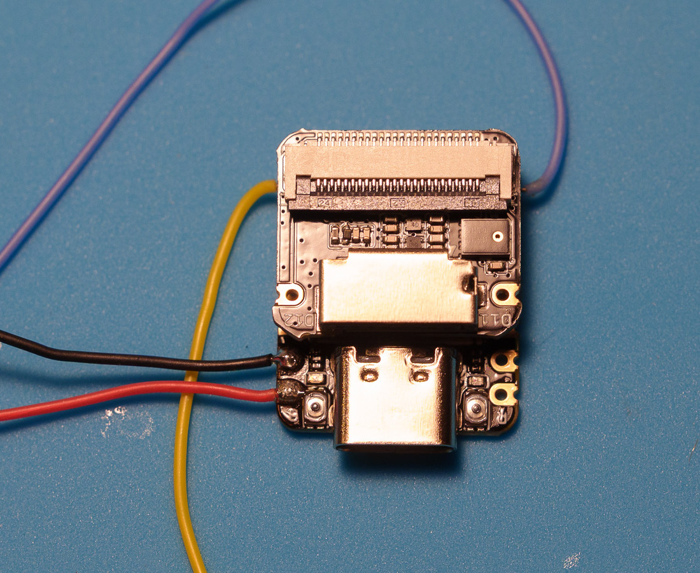

# FPV Audio Recorder

Onboard FPV audio without carrying an extra GoPro or other action camera. This work in progress is a tiny, battery-free audio recorder for a quadcopter. The build uses a Seeed Studio XIAO ESP32S3 Sense, its microphone and microSD expansion board, and flight-controller power. The intended firmware starts a WAV when the quad arms and closes it when the quad disarms.

**Project status:** Bench recording works. The camera has been removed, and a local Easy Eject preview successfully flashed the recorder, read its temperature, and imported a WAV while leaving the microSD original intact. A [bench firmware candidate](firmware/README.md) and version manifest are available for the planned Easy Eject update check. Flight-controller wiring and arm/disarm behavior still need hardware testing. This is not yet a flight-ready release.

The public progress page is at <https://rsmith4321.github.io/fpv-audio-recorder/>.

Follow the [photographed prototype build](docs/build.md) for camera removal, the four recorder wires, and the planned diode connection. **Next: connect the flight controller and test arm/disarm recording with props off.**

## What has been verified

- A 120-second mono, 16 kHz, 16-bit WAV was recorded to microSD and retrieved over USB.
- With no airflow, the ESP32-S3 internal temperature rose from 50.7°C at the start to 65.7°C when recording finished, reaching 67.7°C during the SD save. This was a bench test, not a mounted flight or long stationary test.
- The current audio level did not clip in a quiet speaker test. Propeller noise has not been recorded yet.
- After camera removal, the recorder microphone, microSD, and USB connection still worked. The imported WAV matched the original byte for byte.

## Planned first-run flow

1. Connect the XIAO Sense to a Mac using a USB data cable.
2. Easy Eject checks the board and installs a versioned recorder firmware image; the removable microSD recordings are left in place.
3. Easy Eject shows chip temperature and imports WAV files from microSD, leaving originals on the card by default.
4. On the quad, the recorder reads armed state from Betaflight over a spare UART and records while armed.

No flight-controller control commands or recorder-overheat messages are planned. Provide airflow whenever the powered quad is stationary, including USB setup.

## Mounting note

The microphone opening is on the exposed face of the Sense board beside the microSD slot. The four wires are soldered to the inward face of the main XIAO's plated edge pads, with low-profile joints protected inside the gap and wires exiting sideways. Check that the board connector seats fully and no solder touches components on the Sense board. A very small piece of VHB can then help retain the stack in a separate flat, component-free part of the gap without covering the microphone opening. Keep the microphone opening, USB port, and SD card accessible. The assembled prototype is photographed in the build guide; the exact tape placement and retention still need testing.

## Next milestones

- Test the streaming WAV firmware against real Betaflight arm/disarm status.
- Package the verified local Easy Eject flow for release, with a documented recovery path.
- Identify exact 5 V, ground, and UART pads on the arriving flight controller.
- Test the assembled quad with props off, then check audio and temperature in flight.

## Scope of this repository

This public repository holds the project page and the versioned bench firmware source and image. Bench audio, raw flash backups, personal device identifiers, and unrelated local build artifacts are intentionally excluded.

## Related work

[FPVSoundLogger](https://github.com/SebGalina/FPVSoundLogger) is another open-source approach to onboard FPV audio recording. This project explores a XIAO Sense with integrated microphone/microSD and Easy Eject setup and import.
