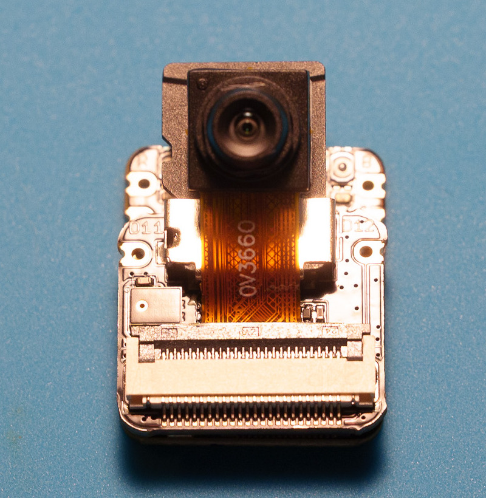
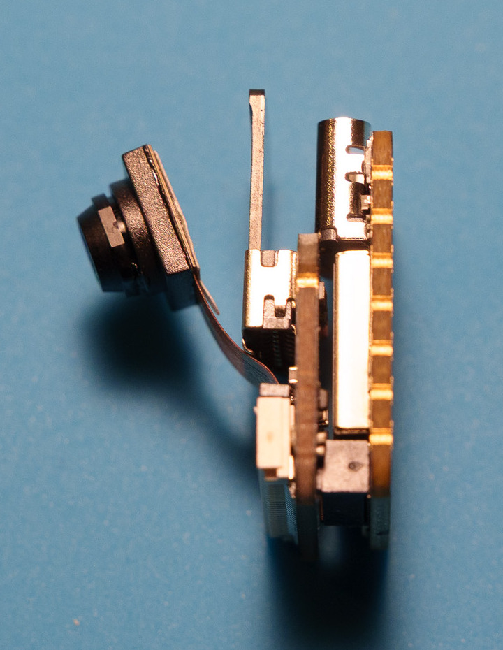
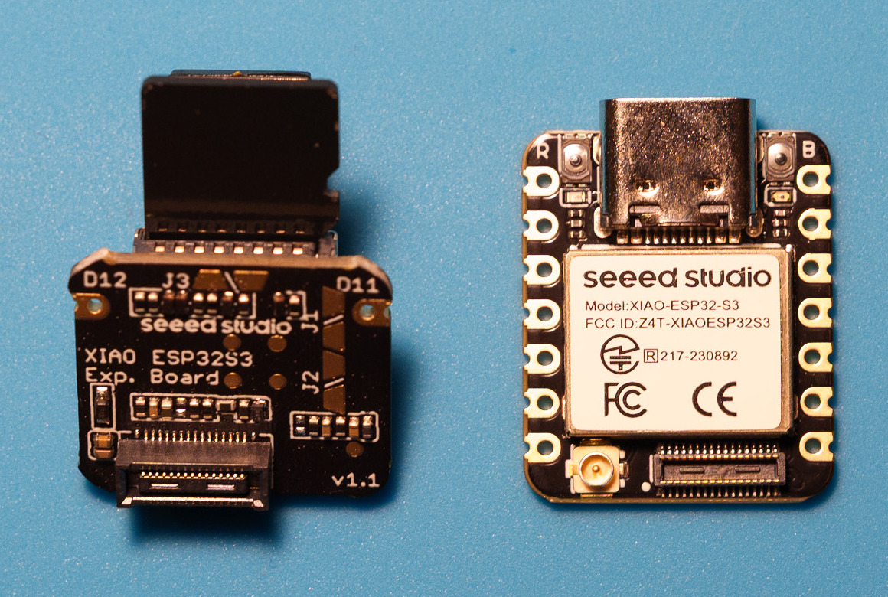
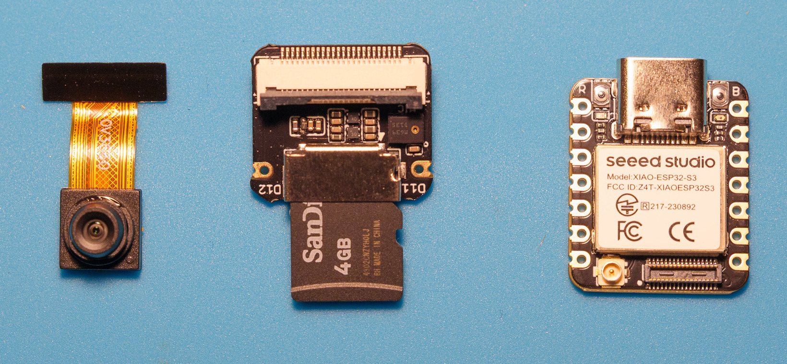
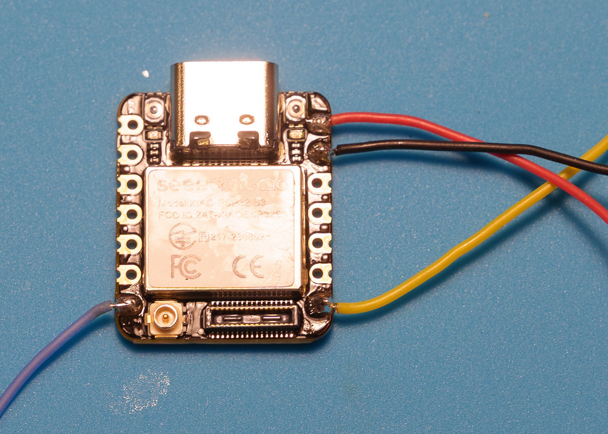

# Prototype build: camera removal and recorder wires

**Work in progress — updated October 7, 2026.** These are Ryan's real build photographs, cropped and lightly sharpened for readability. Solder joints and components have not been retouched. This documents the prototype, not a completed flight-tested installation.

Bench audio recording, USB retrieval, and a local Easy Eject firmware install/import have worked. The Flywoo controller and an unused UART1 connector have now been identified. The next step is assembling the connector harness and testing its supply and arm/disarm recording with props removed. See the [Flywoo connector installation plan](flywoo-goku-f405-se.md).

## Hardware

- Seeed Studio XIAO ESP32S3 **Sense**, including its microphone/microSD expansion board.
- microSD card prepared for the recorder firmware.
- Four lightweight insulated wires; this prototype uses roughly 6–7 inch lengths, to be trimmed for the quad.
- One 1N5817 Schottky diode for the regulated 5 V power lead, solder and heat-shrink tubing.
- A small piece of 3M VHB tape for retaining the stack after checking clearance.
- USB data cable for setup. No separate recorder battery.

The [Seeed pin map and power instructions](https://wiki.seeedstudio.com/xiao_esp32s3_getting_started/) are the reference for VBUS/5V, ground, D6/TX and D7/RX. Flight-controller pad names and supply capacity must be checked for the specific controller before connecting it.

## 1. Original stack

The camera arrives attached to the Sense expansion board. The microphone and microSD slot are on that expansion board, so the expansion board stays in the recorder.

The side view shows the two-board construction and connector gap.

## 2. Separate the boards and remove the camera

With USB and all power disconnected, gently separate the two boards at their board-to-board connector. Support the boards rather than pulling on the camera ribbon.

Carefully release the camera connector's small dark locking flap, then slide out the camera ribbon. Keep the microphone and SD board intact. In the following photograph the removed camera is on the left, the Sense expansion board is in the middle, and the main XIAO is on the right.

The microphone is the small rectangular package with a circular opening beside the microSD holder. Its opening must stay unobstructed.

## 3. Solder four wires to the main XIAO

This prototype solders to the inward face of the plated edge pads, with the wires exiting sideways. Keep joints low enough that the Sense board can fully seat without touching solder or exposed wire. No pin headers are fitted.

| Wire in this prototype | XIAO pad | Intended flight-controller connection |
| --- | --- | --- |
| Red | VBUS (called 5V in Seeed's pin map) | Regulated 5 V **through the diode** |
| Black | GND | Ground |
| Purple | D6 / TX / GPIO43 | Spare UART RX |
| Yellow | D7 / RX / GPIO44 | The same UART's TX |

In this photograph, USB is at the top: red and black are at the upper right; purple is at the lower left and yellow at the lower right. Always verify pad labels and the official pin map; a flipped board reverses the apparent sides.

The photo records the prototype joints. Check for bridges, loose strands and clearance, and check the unpowered power wiring for a short before reconnecting USB. A photograph cannot establish electrical continuity.

## 4. Reassemble and retain the stack

Align and fully seat the board-to-board connector without forcing it. The microphone is on the exposed face beside the SD slot, away from the gap between boards.

After solder inspection and camera removal, use a very small VHB patch in a flat, component-free part of the gap to help secure the boards together. The tape must fit without lifting the connector or pressing on components. The exact tape placement and crash retention still need testing. Keep USB, the SD card and the microphone opening accessible.

## 5. Next: diode, flight-controller wiring and testing

The diode is not shown installed in these photographs. Fit **one** diode inline in the red lead: the unstriped anode goes toward the flight controller's regulated 5 V supply; the striped cathode goes toward the XIAO VBUS pad. Insulate the diode and both joints with heat shrink. Never connect VBUS directly to quad battery voltage. Seeed specifies a series diode for external power into this pad.

For the Flywoo GOKU F405 SE prototype, the [controller-specific connector plan](flywoo-goku-f405-se.md) uses its unused UART1 five-position socket and a supplied four-wire harness, avoiding soldering onto the flight controller. That socket supplies 4.5 V. The harness, diode and MSP configuration were completed on October 10, 2026, and the recorder ran from that socket through the diode with its USB unplugged, starting on arm and closing the file on disarm (see the connector plan for photos and results). For other controllers, identify the exact regulated supply, ground and spare UART before connecting.

Provide airflow while the powered quad is stationary, including computer setup. The two-minute still-air bench result is an observation, not a long-idle thermal rating. Mounted audio level, temperature, vibration, retention and power-loss behavior remain unverified.

## Software status

The [bench firmware](../firmware/README.md) is published. Easy Eject has been tested as a local preview for flashing, chip-temperature display and WAV import while preserving the card original. This integration is not yet in the public Easy Eject download. See the [Easy Eject project help page](https://easyeject.com/help/fpv-audio-recorder).
