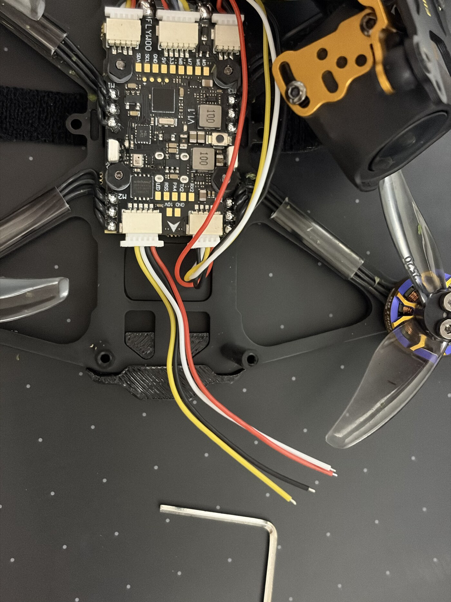
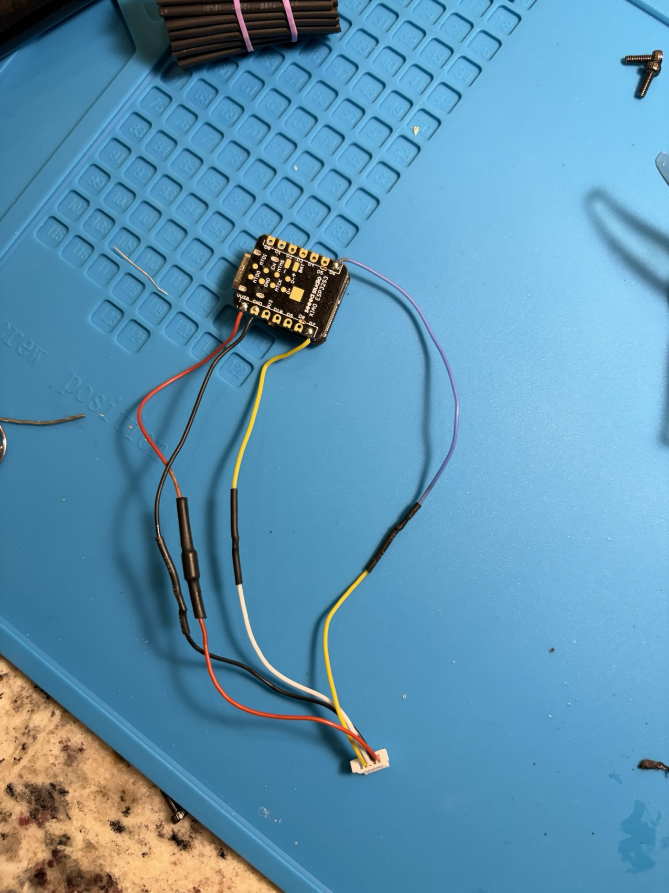
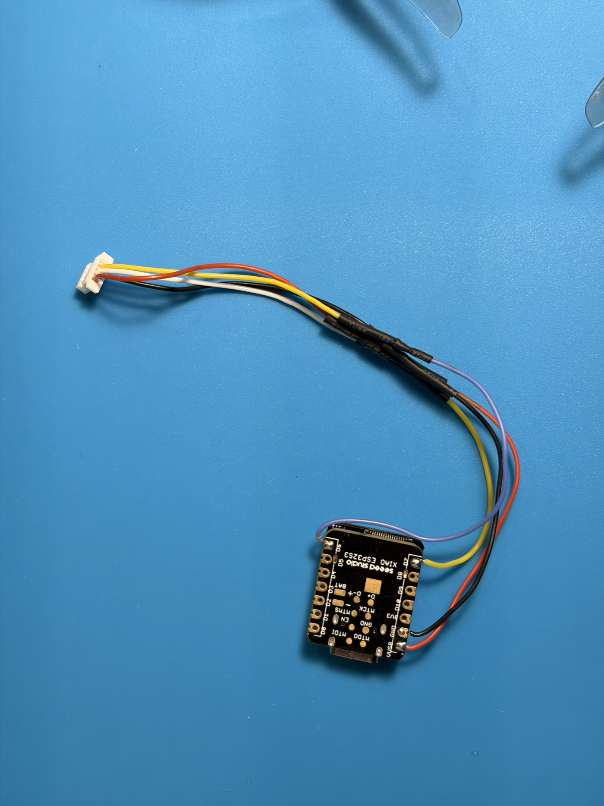
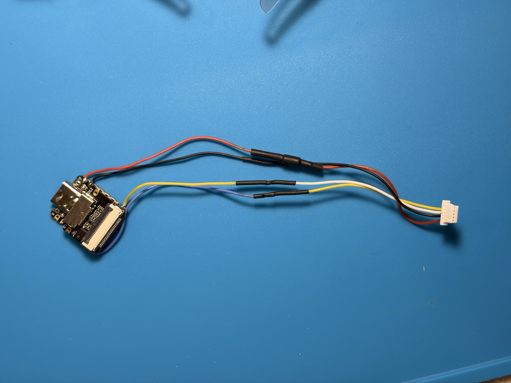
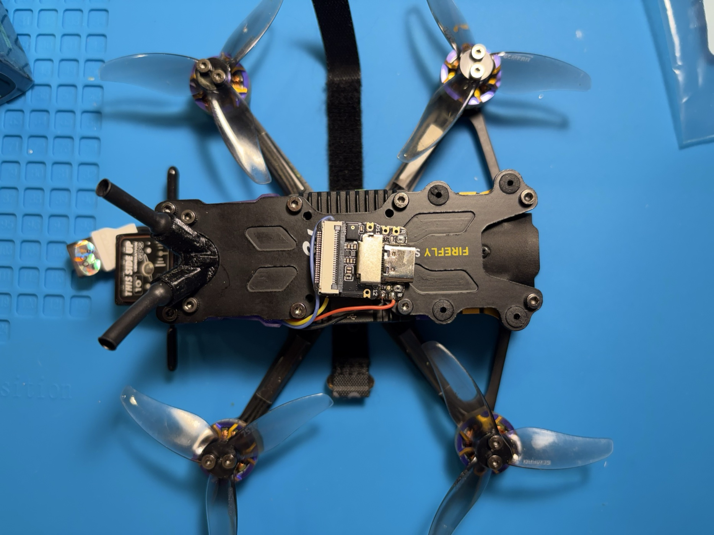
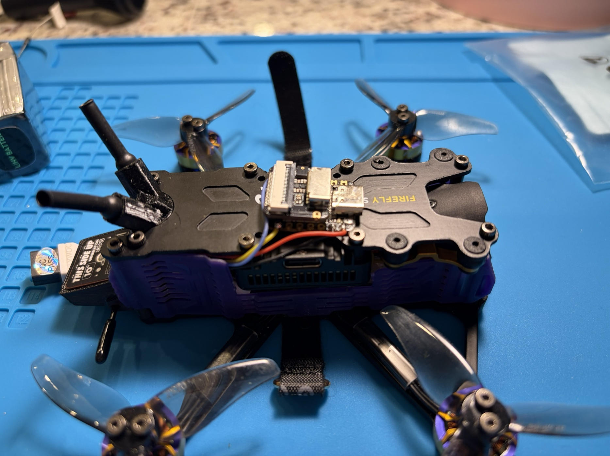
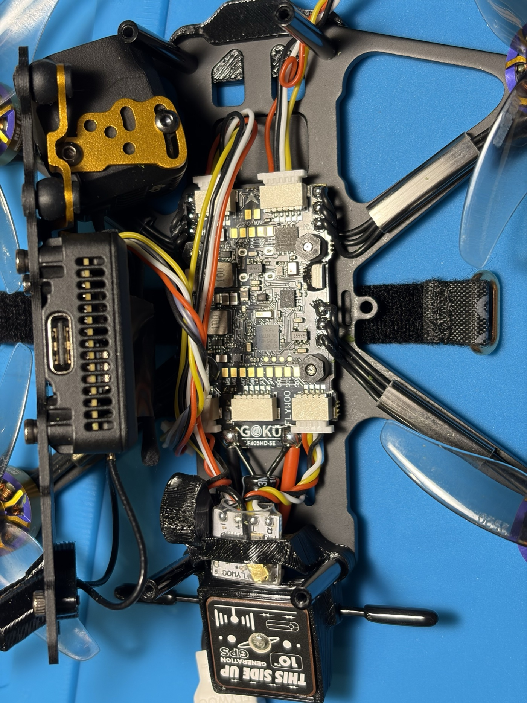
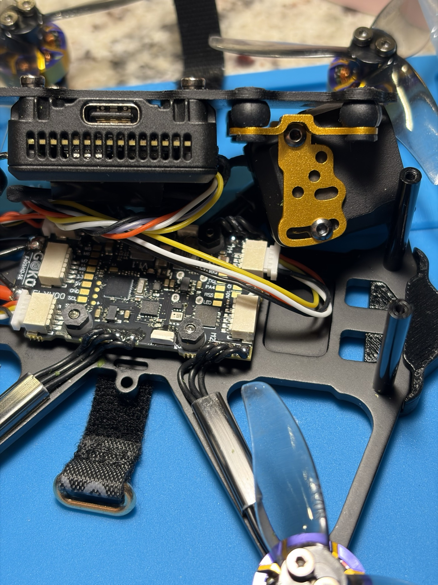
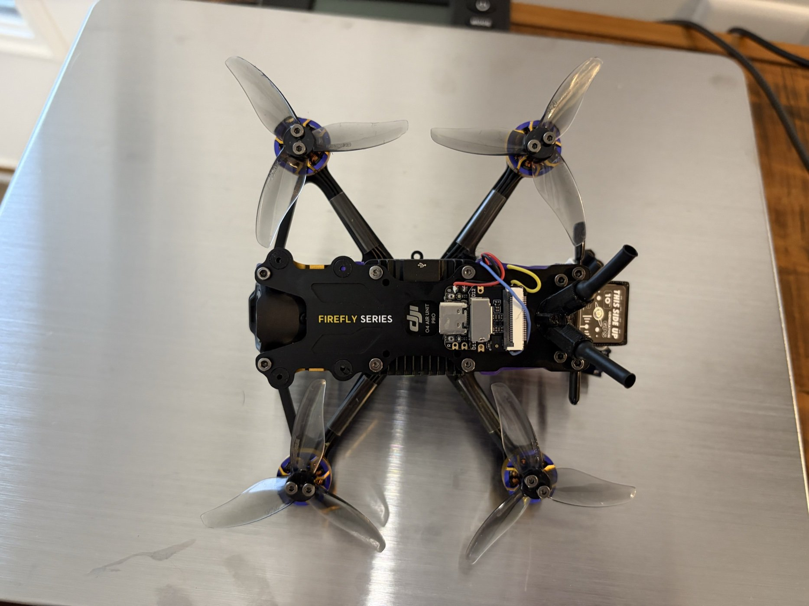
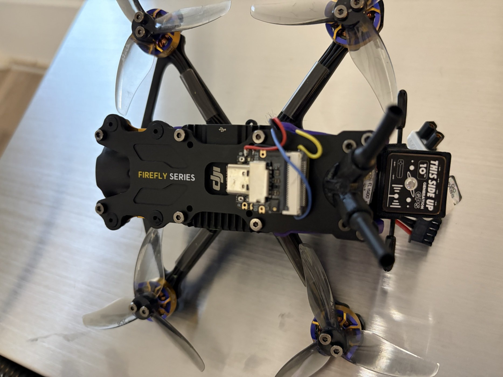

# Flywoo GOKU F405 SE: connector installation plan

**Work in progress — October 7, 2026.** This plan avoids soldering onto the flight controller. The recorder still needs its four XIAO pad wires, soldered cable splices, an inline diode, and heat-shrink insulation. The harness has been fitted for inspection; the recorder has **not** been connected or powered from it yet.

## Identified hardware and verified port allocation

The prototype quad uses a **Flywoo GOKU F405 SE 3–4S 20A AIO**, board marking V1.1, with a BMI270 gyro. The connected controller identifies as `FLWO/FLYWOOF405S_AIO`, running Betaflight **2025.12.2**. The live Betaflight Ports page was checked on October 7:

| Port | Observed configuration |
| --- | --- |
| UART1 | Unassigned; selected for the recorder |
| UART3 | Serial receiver (ELRS) |
| UART4 | GPS |
| UART6 | MSP and VTX (MSP + DisplayPort), used by DJI O4 |

No Betaflight settings were changed during this check. An unused serial port in software does not establish the physical connector pinout; the manufacturer diagram and the actual harness were checked separately.

## Socket and cable

References: [Flywoo SE manual](https://flywoo.net/pages/goku-2-4s-se-20a-aio) and [full-size official connector diagram](https://img-va.myshopline.com/image/store/1673593876355/73502be504824d0fb2e820800d34d2b9.webp?h=1755&w=2482). The manual page title says 2–4S, while the supplied card and product listing say 3–4S; match the SE board layout and revision rather than using the different square F405 HD AIO diagram.

The UART1 socket is the **upper-right five-position socket in the official diagram**, labeled `4.5V / GND / TX1 / RX1 / SBUS(1)`. It is the **bottom-left socket in the photograph below**, because the board is rotated 180 degrees relative to that diagram.

Use the supplied **five-position plug with four populated wires and free tinned ends**. The unused position is SBUS(1). Count housing positions, not just wires. A four-position housing is not the same connector; do not force it into this socket.

The photograph and manufacturer diagram establish the visual mapping for this specific harness. They do not constitute a multimeter continuity or voltage measurement. Other cable colors and connector pin arrangements may differ.

## Planned wire connections

Disconnect the quad battery and both USB connections before assembling the wiring. For the pictured harness and the recorder wire colors used in this prototype:

| Flywoo harness wire | UART1 pin | Recorder connection |
| --- | --- | --- |
| Red | 4.5V | Through one 1N5817 Schottky diode to red XIAO VBUS wire |
| Black | GND | Black XIAO GND wire |
| White | TX1 | Yellow XIAO D7 / RX / GPIO44 wire |
| Yellow | RX1 | Purple XIAO D6 / TX / GPIO43 wire |
| Empty position | SBUS(1) | Unused |

TX and RX are crossed. Use the ordinary RX1 connection, **not SBUS(1)**. Confirm pin-to-wire continuity on the unpowered harness before connecting the recorder.

Fit the diode in the power wire: **unstriped anode toward the Flywoo; striped cathode toward XIAO VBUS**. Insulate each splice and the diode with heat shrink. The diode blocks USB power from feeding backward into the flight-controller supply. Do not connect recorder VBUS to the board's 10V or BAT connections.

This cable connects directly to the recorder's existing wires; no flight-controller pad soldering is planned. Trim and secure the harness so it cannot reach the propellers or pull on the socket.

## 4.5V supply: proposed, not yet verified

The socket is labeled **4.5V**, rather than 5V. The diode further reduces the voltage at VBUS. Audio-only operation is expected to be feasible, but it has **not been tested on this supply**. Seeed documents audio/SD operation from a battery through a different power path; that is not proof of this VBUS connection. See [Seeed's power instructions](https://wiki.seeedstudio.com/xiao_esp32s3_getting_started/).

Before accepting this installation, measure the supply and recorder VBUS voltage under load, then test cold starts, recording, and file finalization with the recorder's USB **disconnected**. USB power could otherwise conceal an inadequate external supply. If it resets or fails to save reliably, stop and revisit the power connection. A separate regulated 5V pad is an alternative, but is outside this connector-only plan and would require flight-controller soldering.

## Pending setup and first test

1. Assemble and inspect the harness, diode, insulation, polarity and unpowered short check.
2. Back up the flight-controller configuration, then enable **MSP on UART1 at 115200 baud**. Preserve receiver, GPS, DJI, flight tuning and mode settings. Save/reboot and read back the configuration.
3. With **propellers removed** and airflow provided, test startup and recorder power from the quad supply, without XIAO USB power.
4. Verify the recorder receives Betaflight armed state, starts on arm and closes the WAV on disarm. Confirm the file plays and repeat the cycle. Do not disable arming protections merely to make this test pass.
5. Check mounted audio, power reliability, temperature, retention and vibration before any flight claim.

## Harness assembled — October 10, 2026

The four splices and the inline diode are soldered and covered with heat shrink. The splices are staggered along the cable so no two joints sit side by side. Red goes to red through the diode, black goes to black, Flywoo white (TX1) goes to the recorder's yellow (D7/RX), and Flywoo yellow (RX1) goes to the recorder's purple (D6/TX). The diode sits inside the larger section of tubing on the red lead. The builder confirmed its striped cathode faces the recorder.

No multimeter continuity, short or voltage checks have been done on the finished harness yet. Pin assignment comes from Flywoo's diagram and the photo of the plug in the socket.

## Trial mounting on the quad — October 10, 2026

The recorder, with its Sense board attached, sits on the quad's carbon top plate behind the camera, held by a small piece of 3M tape. USB-C, the microSD card and the microphone stay exposed. The harness runs down the side of the frame to the UART1 socket. This is a temporary mount; a small 3D-printed mount is planned.

Carbon fiber conducts electricity, so the tape must keep every pad and solder joint on the underside and edges of the XIAO off the plate. Secure the harness so it cannot be pinched between plates or standoffs, rub on screw heads, or reach the propellers.

## Final mount and first armed tests — October 10, 2026

The recorder is now held to the top plate with 3M VHB, behind the DJI O4 Air Unit Pro, with the USB-C port, microSD card and microphone facing up. The VHB is foam and does not conduct, so it also keeps the XIAO's underside off the carbon. The recorder firmware leaves Wi-Fi and Bluetooth off, so the only thing near the O4 antennas and the GPS is the small board itself.

UART1 was set to MSP at 115200 in Betaflight (one line changed; rollback is `serial UART1 0 115200 57600 0 115200`, then `save`). With the recorder's USB unplugged and power coming only from the 4.5 V socket through the diode, arming started a recording and disarming closed a playable WAV. That covered a props-off test and three short indoor hand-held hovers.

The props-off audio was hot, about −14 dBFS on average, with a few clipped samples. A local test firmware (not yet published here) filters out the microphone's DC offset, turns the level down 12 dB, and writes an `RECLOG.TXT` line for each recording. On the indoor hovers it averaged about −30 dBFS with peaks near −12 dBFS and no clipped samples in the files. The peaks show the microphone path was already close to its limit before the turn-down, so louder outdoor flying may still distort. The planned fix is acoustic: foam or a thin layer of tape over the microphone port, or a printed enclosure with a foam-covered port.

**Current stopping point:** harness, diode and VHB mount complete; arm/disarm recording works on quad power. Outdoor flight audio, GPS reception with the recorder powered, temperature, vibration and retention remain unverified.
